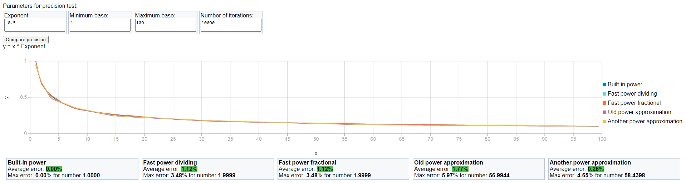
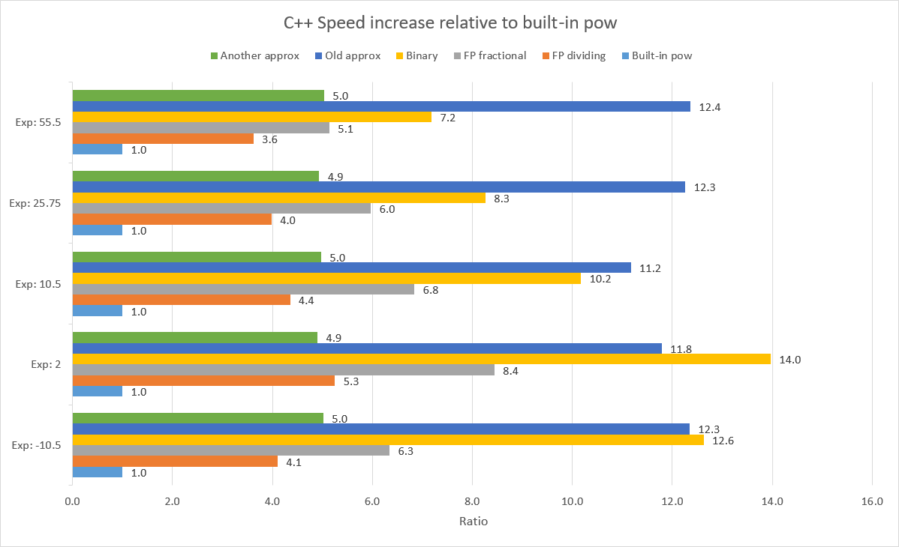

# Fast exponentiation

## Description

This repository contains realizations of various algorithms for fast exponentiation with small error in C++, C# or Java.  
More info: —————— Link to article ——————

## List of algorithms

1. "Old" approximation
2. Binary power
3. Dividing fast power
4. Fractional fast power
5. "Another" approximation

## Repository structure

There are 9 projects in **visual studio solution**, which are meant for testing custom algorithms, including [web page]() for precision tests.



You can check results of performance measures in [this excel table](Performance%20results/Results.xlsx).



# Algorithms realizations

## ["Old" approximation](https://habr.com/ru/company/infopulse/blog/336110/)

### [In C++](https://github.com/alordash/FastExponentiation/blob/6d758e7bba7c2bc6433bdf1bb1b52655f89790ea/FastExponentiation/FastMathCpp/FastMath.cpp#L16)
```c++
double OldApproximatePower(double b, double e) {
    union {
        double d;
        long long i;
    } u = { b };
    u.i = (long long)(4606853616395542500L + e * (u.i - 4606853616395542500L));
    return u.d;
}
```
<details>
<summary><a href="https://github.com/alordash/FastExponentiation/blob/6d758e7bba7c2bc6433bdf1bb1b52655f89790ea/FastExponentiation/FastMath/FastMath.cs#L21">In C#</a></summary>

```C#
double OldApproximatePower(double b, double e) {
	long i = BitConverter.DoubleToInt64Bits(b);
	i = (long)(FastMath.doubleApproximator + e * (i - FastMath.doubleApproximator));
	return BitConverter.Int64BitsToDouble(i);
}
```
</details>

<details>
<summary><a href="https://github.com/alordash/FastExponentiation/blob/071ebb67d214b165c5f5cb4798fdfaf63b7fc4bb/Java/FastMath/src/FastMath.java#L15">In Java</a></summary>

```java
double OldApproximatePower(double b, double e) {
    long i = Double.doubleToLongBits(b);
    i = (long) (FastMath.doubleApproximator + e * (i - FastMath.doubleApproximator));
    return Double.longBitsToDouble(i);
}
```
</details>

## [Binary power](https://en.wikipedia.org/wiki/Exponentiation_by_squaring)

### [In C++](https://github.com/alordash/FastExponentiation/blob/6d758e7bba7c2bc6433bdf1bb1b52655f89790ea/FastExponentiation/FastMathCpp/FastMath.cpp#L3)
```c++
double BinaryPower(double b, unsigned long long e) {
	double v = 1.0;
	while(e != 0) {
		if((e & 1) != 0) {
			v *= b;
		}
		b *= b;
		e >>= 1;
	}
	return v;
}
```
<details>
<summary><a href="https://github.com/alordash/FastExponentiation/blob/6d758e7bba7c2bc6433bdf1bb1b52655f89790ea/FastExponentiation/FastMath/FastMath.cs#L5">In C#</a></summary>

```c#
double BinaryPower(double b, UInt64 e) {
	double v = 1d;
	while(e != 0) {
		if((e & 1) != 0) {
			v *= b;
		}
		b *= b;
		e >>= 1;
	}
	return v;
}
```
</details>

<details>
<summary><a href="https://github.com/alordash/FastExponentiation/blob/071ebb67d214b165c5f5cb4798fdfaf63b7fc4bb/Java/FastMath/src/FastMath.java#L2">In Java</a></summary>

```java
double BinaryPower(double b, long e) {
    double v = 1d;
    while (e > 0) {
        if ((e & 1) != 0) {
            v *= b;
        }
        b *= b;
        e >>= 1;
    }
    return v;
}
```
</details>

## Dividing fast power
### [In C++](https://github.com/alordash/FastExponentiation/blob/6d758e7bba7c2bc6433bdf1bb1b52655f89790ea/FastExponentiation/FastMathCpp/FastMath.cpp#L28)
```c++
double FastPowerDividing(double b, double e) {
	// To avoid undefined behaviour near key points,
	// we can hardcode results for them, but this
	// will make function slower.
	if(b == 1.0 || e == 0.0) {
		return 1.0;
	}

	double eAbs = fabs(e);
	double el = ceil(eAbs);
	double basePart = OldApproximatePower(b, eAbs / el);

	double result = BinaryPower(basePart, (long long)el);
	// Because OldApproximatePower gives inaccurate results
	// with negative exponent, we can increase precision
	// by calculating exponent of a number in positive power
	// and then dividing 1 by result of calculation
	if(e < 0.0) {
		return 1.0 / result;
	}
	return result;
}
```
<details>
<summary><a href="https://github.com/alordash/FastExponentiation/blob/6d758e7bba7c2bc6433bdf1bb1b52655f89790ea/FastExponentiation/FastMath/FastMath.cs#L27">In C#</a></summary>

```c#
double FastPowerDividing(double b, double e) {
	if(b == 1d || e == 0d) {
		return 1d;
	}

	var eAbs = Math.Abs(e);
	var el = Math.Ceiling(eAbs);
	var basePart = OldApproximatePower(b, eAbs / el);
	var result = BinaryPower(basePart, (long)el);
    
	if(e < 0d) {
		return 1d / result;
	}
	return result;
}
```
</details>

<details>
<summary><a href="https://github.com/alordash/FastExponentiation/blob/071ebb67d214b165c5f5cb4798fdfaf63b7fc4bb/Java/FastMath/src/FastMath.java#L25">In Java</a></summary>

```java
double FastPowerDividing(double b, double e) {
    if (b == 1d || e == 0d) {
        return 1d;
    }

    var eAbs = Math.abs(e);
    var el = Math.ceil(eAbs);
    var basePart = OldApproximatePower(b, eAbs / el);
    var result = BinaryPower(basePart, (long) el);
    
    if (e < 0d) {
        return 1d / result;
    }
    return result;
}
```
</details>

## Fractional fast power
### [In C++](https://github.com/alordash/FastExponentiation/blob/6d758e7bba7c2bc6433bdf1bb1b52655f89790ea/FastExponentiation/FastMathCpp/FastMath.cpp#L58)
```c++
double FastPowerFractional(double b, double e) {
	if(b == 1.0 || e == 0.0) {
		return 1.0;
	}

	double absExp = fabs(e);
	long long eIntPart = (long long)absExp;
	double eFractPart = absExp - eIntPart;
	double result = OldApproximatePower(b, eFractPart) * BinaryPower(b, eIntPart);
    
	if(e < 0.0) {
		return 1.0 / result;
	}
	return result;
}
```
<details>
<summary><a href="https://github.com/alordash/FastExponentiation/blob/6d758e7bba7c2bc6433bdf1bb1b52655f89790ea/FastExponentiation/FastMath/FastMath.cs#L59">In C#</a></summary>

```c#
double FastPowerFractional(double b, double e) {
	if(b == 1d || e == 0d) {
		return 1d;
	}

	double absExp = Math.Abs(e);
	long eIntPart = (long)absExp;
	double eFractPart = absExp - eIntPart;
	double result = OldApproximatePower(b, eFractPart) * BinaryPower(b, eIntPart);

	if(e < 0d) {
		return 1d / result;
	}
	return result;
}
```
</details>

<details>
<summary><a href="https://github.com/alordash/FastExponentiation/blob/5cb25a4ceb1963ee84fd80fc8000cafbedd7e47e/Java/FastMath/src/FastMath.java#L53">In Java</a></summary>

```java
double FastPowerFractional(double b, double e) {
    if (b == 1d || e == 0d) {
        return 1d;
    }

    double absExp = Math.abs(e);
    long eIntPart = (long)absExp;
    double eFractPart = absExp - eIntPart;
    double result = OldApproximatePower(b, eFractPart) * BinaryPower(b, eIntPart);

    if(e < 0d) {
        return 1d / result;
    }
    return result;
}
```
</details>

## [Another approximation](https://martin.ankerl.com/2007/10/04/optimized-pow-approximation-for-java-and-c-c/)

### [In C++](https://github.com/alordash/FastExponentiation/blob/6d758e7bba7c2bc6433bdf1bb1b52655f89790ea/FastExponentiation/FastMathCpp/FastMath.cpp#L77)
```c++
double AnotherApproximatePower(double a, double b) {
	union {
		double d;
		int x[2];
	} u = { a };
	u.x[1] = (int)(b * (u.x[1] - 1072632447) + 1072632447);
	u.x[0] = 0;
	return u.d;
}
```
<details>
<summary><a href="https://github.com/alordash/FastExponentiation/blob/6d758e7bba7c2bc6433bdf1bb1b52655f89790ea/FastExponentiation/FastMath/FastMath.cs#L78">In C#</a></summary>

```c#
double AnotherApproxPower(double a, double b) {
	int tmp = (int)(BitConverter.DoubleToInt64Bits(a) >> 32);
	int tmp2 = (int)(b * (tmp - 1072632447) + 1072632447);
	return BitConverter.Int64BitsToDouble(((long)tmp2) << 32);
}
```
</details>

<details>
<summary><a href="https://github.com/alordash/FastExponentiation/blob/5cb25a4ceb1963ee84fd80fc8000cafbedd7e47e/Java/FastMath/src/FastMath.java#L72">In Java</a></summary>

```java
double AnotherApproxPower(double a, double b) {
	int tmp = (int)(Double.doubleToLongBits(a) >> 32);
	int tmp2 = (int)(b * (tmp - 1072632447) + 1072632447);
	return Double.longBitsToDouble(((long)tmp2) << 32);
}
```
</details>